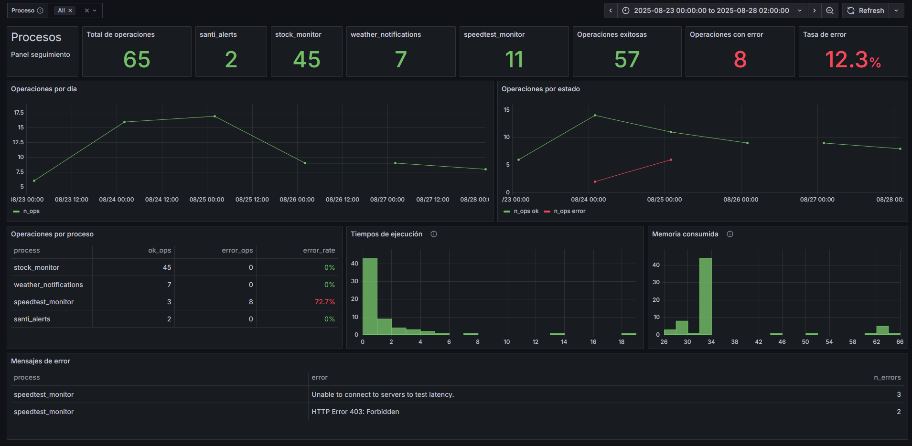

En mi artículo anterior, _La cara oculta de la automatización sin código_, me centré en analizar uno de los pilares que considero fundamentales a la hora de automatizar un proceso: la relación coste-beneficio. Como señalaba entonces, en el actual entusiasmo por la automatización se habla mucho de las ventajas, pero muy poco (o nada) de los riesgos y costes reales de implementar estos sistemas en entornos productivos.

Hoy quiero detenerme en otro aspecto que suele pasarse por alto: **qué ocurre cuando las cosas fallan**. Existe la percepción de que, una vez automatizado un proceso, este funcionará de manera indefinida sin necesidad de atención. La realidad es muy distinta: los procesos automáticos también fallan y, por tanto, requieren monitorización continua.

Al automatizar un flujo de trabajo, ya sea en una empresa o a nivel individual, lo que se está delegando a un sistema es una tarea replicable y mecánica que, por definición, resulta relevante. Precisamente por eso, cuando ese proceso falla, el impacto puede ser inmediato. Pensemos en un sistema que recibe tickets de clientes y los asigna automáticamente a la persona responsable. Mientras todo funciona, el cliente abre un ticket, el sistema lo asigna y alguien lo resuelve: rápido y sin fricciones. Pero si el sistema falla y nadie lo detecta, el ticket nunca se asigna, el cliente se queda sin respuesta y el proveedor incumple los SLA (acuerdo de nivel de servicio). El problema ya está servido.

Por eso, **tan importante como automatizar es monitorizar**. Y la monitorización no es un detalle menor: implica evitar que los procesos fallen de forma silenciosa, definir cómo detectar esos fallos y establecer mecanismos de notificación eficaces.

En las próximas líneas voy a mostrar un ejemplo concreto a partir del sistema de monitorización que utilizo en mis propios procesos automatizados. Mi objetivo es subrayar cómo la observabilidad se convierte en una pieza esencial de cualquier sistema automático y por qué su implementación, aunque requiera un esfuerzo adicional, es clave para que la automatización sea realmente fiable. Al fin y al cabo, no es lo más atractivo reconocer que uno ha invertido horas de trabajo en prepararse para los fallos, pero esa inversión suele marcar la diferencia entre el éxito y el desastre.

# Cuando los problemas llegan

Cuando empecé a automatizar procesos, como le ocurre a casi todo el mundo, mi mayor preocupación era que el sistema pudiera fallar. Por eso invertía mucho tiempo en diseñar los scripts y hacer pruebas exhaustivas, tratando de cubrir todas las contingencias posibles. Pasaba días afinando los detalles hasta asegurarme de que el proceso funcionaba tal y como esperaba. Una vez lo lograba, lo daba por terminado y pasaba a otra cosa, satisfecho con el trabajo.

El problema es que, como creo que le ocurre a muchos, no estaba pensando en una dimensión fundamental: **el tiempo**. Todas mis pruebas se limitaban al presente, a las condiciones exactas en las que estaba desarrollando. Pero no podía anticipar lo que sucedería semanas o meses después.

La realidad es que cuando automatizas un proceso te aseguras de que funciona en ese momento, bajo unas circunstancias concretas. Lo difícil es prever cómo se comportará a largo plazo. Basta con que cambie un servicio externo, falle puntualmente la conexión a internet o se modifique la estructura de una fuente de datos para que todo se rompa. Y eso ocurre simplemente porque el tiempo ha pasado y esas variables nunca estuvieron bajo tu control.

A mí me ha costado algún disgusto: descubrir semanas después que un proceso que daba por hecho que estaba funcionando llevaba tiempo parado, y que toda la información que debía recoger se había perdido. Experiencias como esta son frustrantes, pero también son las que realmente te enseñan.

La lección más valiosa es que siempre habrá factores fuera de tu control. Lo único que puedes hacer es prepararte para detectarlos a tiempo y asegurarte de que nunca pasen desapercibidos.

# La observabilidad como respuesta

Como comenté en mi artículo previo, tengo varios procesos automatizados que he ido desarrollando con el tiempo. Algunos, como el de monitorización de ofertas, tienen un uso meramente práctico; otros, en cambio, forman parte de pruebas o proyectos personales en los que estoy trabajando. En todos los casos, desde el principio me propuse una regla básica: que estos procesos **no fallaran de forma silenciosa**. Tenía que disponer de un mecanismo para saber si estaban funcionando correctamente.

En mi investigación, la solución más sencilla que encontré fue identificar en el código cuándo se producía un error y enviarme un correo o una notificación para revisarlo. Lo probé y, aunque era efectivo, no me resultaba satisfactorio. En mi caso había dos problemas. El primero: odio el spam, y recibir correos automáticos cada vez que algo fallaba me lo recordaba demasiado. El segundo: descubrí que no todos los fallos eran iguales.

Algunos de mis procesos sufrían lo que llamo **fallos recuperables e independientes**: errores puntuales que se resuelven solos en la siguiente ejecución. Esto ocurre, por ejemplo, si en un momento dado se cae la conexión a internet o si una API devuelve un error 500 de forma aislada. En estos casos, el aviso automático de “ha habido un error, revísalo” acaba siendo una pérdida de tiempo, porque en realidad no había nada que yo debiera corregir.

> **Nota**: Este tipo de alertas, sin embargo, resultan muy útiles si el proceso es crítico y debe relanzarse inmediatamente. Para ello existen herramientas y configuraciones específicas que permiten reiniciar un flujo de trabajo cuando se detecta un fallo.

Esto me llevó a buscar otra solución y fue entonces cuando me encontré con el concepto de **observabilidad**. La observabilidad hace referencia a la capacidad que tenemos para comprender el estado interno de un sistema a partir de su telemetría. Es un enfoque muy utilizado en entornos IT y me pareció exactamente lo que necesitaba: no solo me permitía saber si algo estaba funcionando, sino también **cómo** estaba funcionando.

En la práctica, la observabilidad consiste en recopilar y analizar datos como logs, métricas o trazas de un sistema con el fin de entender su comportamiento a lo largo del tiempo. De esta forma, no se trata únicamente de detectar un error puntual, sino de disponer de información suficiente para identificar patrones, anticipar problemas y diagnosticar con mayor rapidez cuando algo falla.

# Monitorizando mis procesos

En mi investigación sobre cómo aplicar observabilidad a mis sistemas automatizados me encontré con un stack muy habitual: Prometheus y Grafana. Prometheus es una herramienta de código abierto diseñada para recopilar y almacenar métricas en una base de datos orientada a series temporales. Grafana, por su parte, es también de código abierto y está enfocada en la creación de paneles interactivos que permiten monitorizar en tiempo real y transformar datos en bruto en dashboards visuales y comprensibles.

Aunque me convencía la propuesta, la idea de implementar y mantener un servicio de Prometheus solo para mis proyectos personales me resultaba excesiva (aunque lo considero la mejor opción para entornos productivos). Así que decidí buscar un término medio.

Finalmente opté por almacenar en PostgreSQL (usando Neon en la nube) las métricas que considero más relevantes en mi caso, e implementar en todos mis procesos una serie de funciones que registran información clave en una tabla. Concretamente, cada vez que se ejecuta un proceso guardo:

- El estado final de la ejecución — _ok_ / _error_
- El tiempo total de ejecución
- La memoria utilizada (MB)
- En caso de error, el mensaje de error correspondiente

Con esto no solo sé si un proceso ha fallado, sino también **si está mostrando síntomas de inestabilidad**. Por ejemplo, monitorizar el tiempo de ejecución me permite detectar si un proceso empieza a tardar más de lo habitual o si presenta variaciones anómalas entre ejecuciones. Esto puede ser señal de que algo no va bien y me da margen para investigarlo antes de que falle por completo. Lo mismo ocurre con el consumo de memoria: un aumento inesperado puede revelar un problema subyacente.

Además, suelo trabajar con arquitecturas _serverless_ para evitar el mantenimiento de servidores. Tener métricas de tiempo y memoria me ayuda a decidir si un proceso puede migrarse de un servidor dedicado a una función en la nube, optimizando así costes y recursos.

Una vez implementado este sistema de registro y seguimiento, construí un **dashboard en Grafana** para visualizarlo todo. El resultado es el siguiente:

Como podéis ver, se trata de un panel sencillo (pero muy efectivo en mi caso) que me permite dar seguimiento al estado de los procesos. Incluye una serie de tarjetas con el número total de ejecuciones, las ejecuciones por proceso y un desglose entre correctas y erróneas, además de una tasa global de error.

Debajo, las series temporales muestran la evolución de las ejecuciones. Gracias a ellas puedo distinguir si un fallo es puntual o si se mantiene en el tiempo. En el ejemplo de la captura, los errores empezaron a aumentar durante un día y continuaron al siguiente, lo que indica que no se trataba de un problema aislado, sino de algo que requería revisión.

El panel también incorpora una tabla con la tasa de error por proceso, lo que permite localizar de inmediato cuál está fallando. En este caso, todos los errores provenían de un mismo script: el que utilizo para comprobar la velocidad de la conexión a internet. Al revisar los mensajes de error en la parte inferior del dashboard vi la secuencia con claridad: primero comenzaron los fallos de conexión al servidor y, más tarde, el servicio empezó a devolver un error 403, señal de que me habían bloqueado el acceso.

He querido mostrar precisamente este periodo porque ilustra perfectamente el objetivo del dashboard: de un solo vistazo supe que un proceso había caído, que el error no era pasajero y que necesitaba cambiar el servicio porque el anterior había dejado de funcionar.

No he hecho demasiado hincapié aquí en los histogramas de tiempo de ejecución y memoria consumida, pero puedo asegurar que resultan muy útiles para entender el comportamiento de los procesos y que son, de hecho, uno de los gráficos en los que más me fijo.

Además, Grafana incorpora varias funcionalidades que lo hacen especialmente valioso. Entre otras:

- **Actualización en tiempo real**: permite establecer intervalos de refresco muy bajos para visualizar datos casi al instante.
- **Flexibilidad en las consultas**: es posible crear visualizaciones a partir de consultas SQL, lo que abre la puerta a métricas y paneles muy personalizados.
- **Alertas avanzadas**: se pueden definir reglas para que el sistema envíe notificaciones cuando se cumplan determinadas condiciones. Al estar basadas en SQL, estas reglas pueden ser tan simples o complejas como se necesite. Un ejemplo típico sería: _“si se producen más de tres ejecuciones erróneas seguidas, avísame”_.

# Conclusión

A lo largo de este artículo he querido mostrar una de las caras menos visibles de la automatización: **los sistemas automáticos van a fallar**, y hay que asumirlo. Lo crucial es implementar las medidas adecuadas para que esos fallos no pasen desapercibidos y no te sorprendan un día. Estas medidas pueden variar según el proceso y las circunstancias, y es fundamental elegir la más apropiada.

Una solución simple y efectiva, como recibir un correo cuando algo falla, puede ser suficiente si el proceso es crítico y requiere intervención inmediata; en estos casos, una falsa alarma es mucho mejor que no recibir ninguna alerta.

La observabilidad, como hemos visto, ofrece una perspectiva mucho más completa: permite entender la salud de un sistema autónomo en detalle y anticipar problemas antes de que se conviertan en fallos graves.

Pero quizá la lección más importante sea sencilla: **un poco de monitorización siempre es mejor que nada**. Incluso los procesos más automáticos necesitan que sepamos cómo están funcionando. Aunque parezcan operar solos, nuestra atención sigue siendo clave para que realmente cumplan su función.
