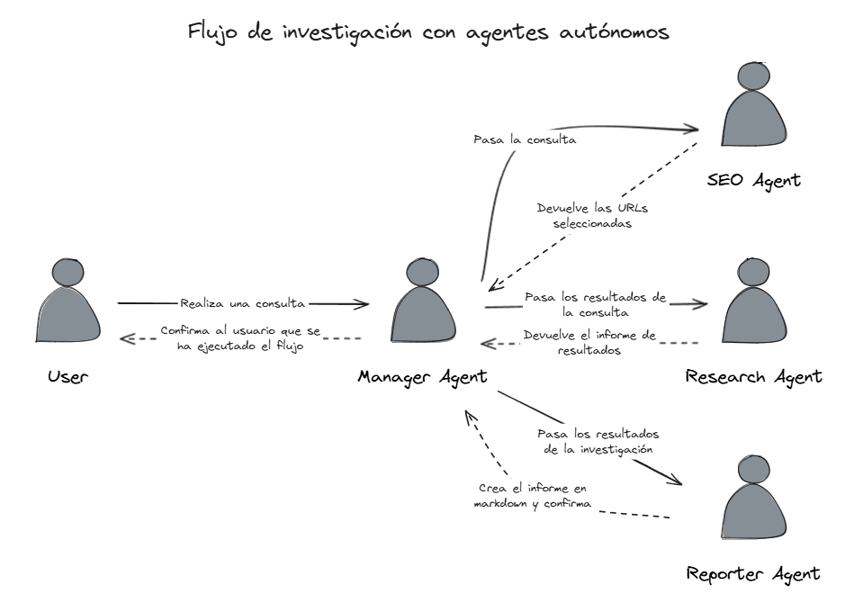
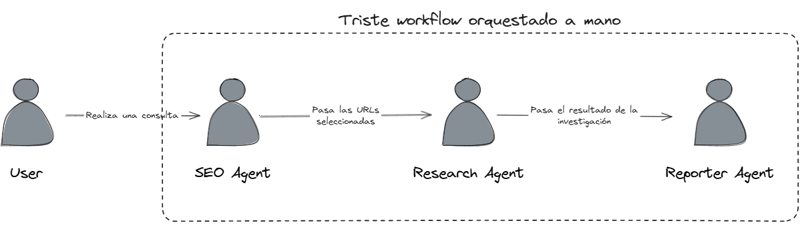
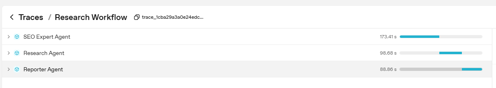
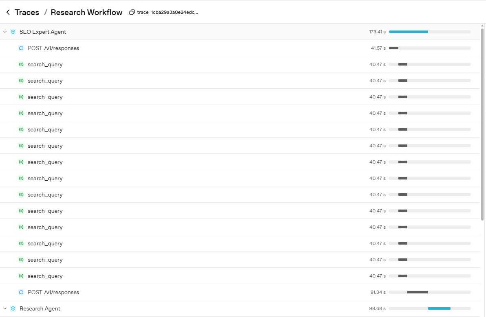
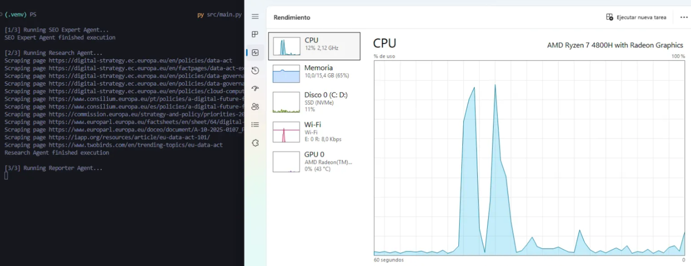

Imagina abrir un navegador o una aplicación y pedirle algo tan concreto como: _“quiero que busques unas zapatillas cómodas de la talla 44 y me las compres”_. La idea de dejar en manos de un sistema totalmente autónomo un proceso completo como este puede sonar exagerada, pero en esa premisa se apoyan los llamados sistemas de inteligencia artificial agénticos. Su objetivo es que agentes controlados por modelos de lenguaje (LLMs) sean capaces de orquestar flujos complejos y tomar decisiones a partir de nuestras peticiones.

Es cierto que hoy por hoy la visión sigue incluyendo la intervención humana en ciertos puntos de control, pero no está tan alejada de lo que ya se anuncia (con bastante entusiasmo) como el futuro inmediato de la IA.

En las últimas semanas he visto varios artículos y vídeos que presentan la IA agéntica como la próxima gran revolución, prometiendo que pronto podremos delegar en ella tareas sofisticadas y prolongadas. Y aunque me considero un firme defensor del potencial transformador de la inteligencia artificial (la uso a diario y me fascina lo que ya permite hacer) también soy consciente de sus limitaciones y problemas actuales.

Precisamente por eso, este repentino furor me despertó la curiosidad: quise profundizar en cómo funcionan realmente estos agentes y ponerlos a prueba en un caso de uso concreto. El resultado de esas pruebas es lo que comparto en este artículo.

# El caso de uso

Para las pruebas decidí partir de un caso de uso simple pero a la vez útil. Quienes me conocen saben que soy una persona curiosa y que disfruta investigando y comprendiendo la tecnología que nos rodea. De hecho, este blog nace precisamente de esa inquietud.

En muchas ocasiones, me sumerjo en temas diversos sobre los que quiero aprender más, lo que implica pasar por largos y tediosos procesos de búsqueda en Google: leer artículos, filtrar información relevante y sintetizar lo importante. Gran parte de lo que se encuentra no es útil o son repeticiones de lo que ya podría haber leído antes.

Partiendo de esta situación, me pregunté: _¿y si pudiera externalizar esta fase en un sistema de IA?_

Así surgió la idea de montar un sistema de investigación agéntico.

# Breve introducción al sistema y los agentes

Antes de entrar en materia quiero aclarar algo: el objetivo de este artículo no es convertirse en una larga explicación técnica sobre cómo implementar estos sistemas. Aun así, durante las pruebas hubo ciertos aspectos técnicos que considero interesantes de compartir. Para no interrumpir la narración principal, he decidido incluir al final (tras las conclusiones) una sección titulada **Notas sobre la implementación técnica**, donde explico con más detalle cómo monté el sistema y enlazo algunos de los artículos que menciono a lo largo del texto. Así, quien quiera profundizar podrá hacerlo sin que el hilo principal se vea cortado.

Dicho esto, vayamos a lo importante.

La inteligencia artificial agéntica es una tecnología reciente y aún rodeada de cierta ambigüedad: no siempre está claro dónde empieza y dónde acaba. Para mí, la mejor explicación sobre qué son los agentes se encuentra en el artículo **Building Effective AI Agents**, publicado por el equipo de **Anthropic**. Reconozco que parte de lo que plantean roza más el juego de palabras que una definición precisa, pero aun así sirve de punto de partida.

En líneas generales, Anthropic distingue entre dos tipos de sistemas agénticos: los **workflows** y los **agentes**. La diferencia es que en los workflows los LLMs se coordinan siguiendo flujos predefinidos en el código, mientras que en los agentes es el propio modelo quien decide cómo orquestar el flujo completo, controlando qué se ejecuta y cuándo. Dicho de este modo puede sonar abstracto, pero confío en que el ejemplo práctico de este artículo lo hará más tangible.

Partiendo de este artículo lo tuve claro: quería construir un sistema de **agentes puros**, en el que todo el flujo estuviera coordinado y ejecutado por un modelo de inteligencia artificial. Para esta tarea decidí usar el nuevo modelo de OpenAI, GPT-5 en su versión nano, y diseñé un sistema compuesto por cuatro agentes:

- **Agente especialista en búsquedas** → su objetivo es realizar búsquedas en Google y obtener resultados relevantes. Recibe un tema, genera las _keywords_ necesarias y lanza las búsquedas. Posteriormente aplica un prefiltrado para evitar duplicidades y asegurarse de que el conjunto de fuentes sea lo suficientemente diverso y de calidad.
- **Agente de investigación** → recibe del especialista en búsquedas un conjunto de páginas y decide de forma autónoma cuáles consultar. Con la información extraída elabora un informe con sus hallazgos.
- **Agente informador** → toma los resultados del agente de investigación y se encarga de redactar un informe final en formato _markdown_. Su tarea se limita a la redacción y el formato: no añade ni elimina información.
- **Agente orquestador o manager** → actúa como coordinador general. Recibe la petición del usuario (en este caso, yo) y gestiona la interacción entre los agentes, además de confirmar al usuario cuándo el proceso ha finalizado.

El flujo completo puede visualizarse en el siguiente diagrama:



Como muestra el diagrama, el flujo se orquesta de forma completamente autónoma. Yo solo tengo que pasarle un tema al **manager** y esperar a que organice a todos los agentes para finalmente confirmarme que ha generado un informe. A simple vista resulta evidente por qué se presenta como “el futuro”: la promesa de delegar todo el proceso y limitarse a recibir el resultado final.

Sin embargo, este planteamiento choca de lleno con la realidad.

# La realidad

Llegados a este punto, toca hablar de lo que ocurrió realmente y de los resultados que obtuve al poner en marcha el sistema. Para la prueba decidí ejecutarlo durante siete días consecutivos, siempre sobre el mismo tema: “soberanía tecnológica europea”. El objetivo era observar cómo se comportaba a lo largo del tiempo con un asunto de relativa actualidad, en el que podían surgir novedades día a día. De esta manera podía evaluar mejor aspectos como la variedad de consultas y de fuentes. Hacer una sola ejecución me parecía insuficiente para sacar conclusiones sobre su rendimiento.

Lo primero que descubrí es que no fui capaz de lograr que el flujo se orquestara de manera completamente autónoma. Por más que lo intenté (iterando con diferentes _prompts_ para el agente de coordinación o manager) nunca conseguí que dirigiera todo el proceso de investigación. En todas las pruebas se limitaba a ejecutar el agente de búsqueda, obtener resultados en Google y devolverme las URLs que consideraba más prometedoras. En la práctica era como si me entregara los enlaces y me dijera: _“ahora investiga tú”_.

A continuación muestro uno de los _prompts_ que utilicé y que tampoco funcionó, para que el lector pueda juzgar por sí mismo si fui lo suficientemente explícito o no:

```bash
You are the Research Manager. You must ALWAYS run a strict 3-step workflow.
Do not skip or change the order of steps. Do not perform subordinate tasks yourself.

Workflow:
1. Handoff the user topic to the SEO Expert Agent. Wait for its response with URLs.
2. Pass those URLs to the Research Agent. Wait for its structured findings with sources.
3. Pass the research findings to the Reporter Agent. Wait for its confirmation that the Markdown file has been generated.

Once step 3 is complete, finish by sending the final message:
"The research report has been generated successfully."

Rules:
- Only the SEO Expert Agent gathers URLs.
- Only the Research Agent decides which URLs to scrape and extracts insights.
- Only the Reporter Agent formats and saves the final Markdown file.
- You must not attempt any of these tasks yourself.
- The process is complete ONLY after the Reporter Agent confirms the file has been saved.
```

Con mi primera decepción a cuestas, tuve que recurrir a la orquestación manual mediante código y aceptar que, desde la perspectiva de Anthropic, mi sistema ni siquiera calificaba como un agente sino como un simple workflow. Llegué a plantearme la posibilidad de reevaluar el sistema utilizando un modelo más grande, como GPT-5 en lugar de la versión nano, aunque reconozco que tengo pocas esperanzas de que eso resuelva el problema de fondo.

A continuación muestro un diagrama (esta vez sí) que refleja cómo funciona realmente el sistema:



Como comentaba previamente, con este sistema implementado y en funcionamiento quedó automatizado y listo para ejecutarse de manera autónoma durante siete días, generando los informes correspondientes. Tal y como explico en la sección de notas técnicas, programé el sistema de manera que pudiera ver y monitorizar lo que ocurría entre bambalinas, para evaluar el rendimiento del agente. Esto me permitió registrar todas las consultas realizadas durante las siete ejecuciones, las URLs evaluadas y cuáles fueron finalmente referenciadas en los informes. Los resultados arrojan datos interesantes.

## Resultados del agente de SEO

Lo primero que observé es que, durante las siete ejecuciones, el agente de búsquedas (SEO Agent) lanzó un total de **90 búsquedas utilizando 78 palabras clave distintas**. Estas **búsquedas generaron un total de 900 URLs** devueltas por la API de búsquedas. Aunque el número pueda parecer elevado, **solo el 48% de ellas eran únicas**. Es decir, a pesar de realizar muchas búsquedas diferentes, los resultados obtenidos eran muy similares.

Un análisis más detallado reveló que esto se debía a que muchos de los términos utilizados eran simplemente variaciones sobre el mismo concepto, lo que hacía que las fuentes encontradas fueran casi siempre las mismas. Algunos ejemplos de estas palabras clave son:

- _europa digital sovereignty policy_
- _europe digital sovereignty strategy_
- _european tech independence_
- _european technological autonomy_
- _european technological sovereignty_

Aquí ya se aprecia un pequeño problema: cierta falta de creatividad al generar las búsquedas. Aun así, el agente consiguió recopilar muchísima más información de la que un humano podría procesar en el mismo tiempo.

Como se explicó previamente, con esta ingente cantidad de URLs el agente de SEO debe realizar una preselección basada en la eliminación de duplicados (que, como hemos visto, son muchos) y en la búsqueda de cierta variedad de fuentes. Tras aplicar este primer filtro, a lo largo de las distintas ejecuciones el agente de SEO facilitó al agente de investigación un total de 430 URLs.

Conviene matizar que las ejecuciones eran independientes, por lo que una URL seleccionada el día 1 podía volver a ser elegida el día 2. Si eliminamos los duplicados entre días, el agente de investigación solo llegó a evaluar 281 URLs distintas. Este dato pone de manifiesto un aspecto llamativo: el agente de SEO tendía a seleccionar las mismas URLs en diferentes ejecuciones.

Con estos datos sobre la mesa, decidí revisar si todas las URLs que el agente de SEO transmitía al agente de investigación estaban efectivamente en el conjunto original de URLs obtenidas de la API de búsquedas. La sorpresa fue que no siempre era así: aparecían algunas URLs nuevas en este paso. Aunque el problema afectaba a un porcentaje residual del total, al tratarse del primer eslabón de la cadena merecía la pena investigarlo.

La revisión detallada me llevó a encontrar dos casos:

1. URLs ligeramente modificadas.

   Se trataba de páginas que sí existían en el conjunto original, pero que el agente de SEO devolvía con un pequeño cambio. Por ejemplo:
   - URL original: `https://www.esade.edu/es/articulos/trump-contra-la-soberania-digital-europea`
   - URL reportada: `https://esade.edu/es/articulos/trump-contra-la-soberania-digital-europea`
     La única diferencia está en el dominio, con o sin las tres "w". En la práctica, esto no supone un problema relevante, ya que el sistema de scraping alcanza igualmente la página gracias a la redirección.

2. URLs inventadas o mal formadas.

   Este caso fue más residual, pero interesante: se detectaron direcciones inexistentes que parecían el resultado de una mezcla o combinación errónea de diferentes fuentes legítimas del conjunto original.

## Resultados del agente de investigación

Llegados a este punto, el trabajo del agente de SEO finaliza y comienza el del agente de investigación. Su cometido es seleccionar, de entre todas las URLs recibidas, aquellas que considera relevantes para analizar y scrapear su contenido. No establecí ningún límite explícito sobre cuántas páginas podía procesar, de modo que disponía de plena autonomía para decidir si hacerlo o no.

En el transcurso de las ejecuciones, el agente de investigación llegó a scrapear un total de 118 URLs, lo que equivale a una media de casi 17 páginas por día. Este dato pone de manifiesto un filtro muy severo: de las numerosas URLs transmitidas por el agente de SEO, solo una fracción relativamente pequeña fue investigada en profundidad. En la práctica, esto implica que la cantidad de información procesada para generar cada informe final no era tan ingente como cabría esperar. De hecho, el análisis de unas 17 páginas diarias no está tan lejos de lo que un investigador humano podría abordar en un esfuerzo sostenido.

Con este resultado en mente, decidí comprobar si todas las URLs procesadas por el agente de investigación provenían efectivamente del conjunto previamente facilitado por el agente de SEO. La revisión reveló que no siempre era así: en 7 ocasiones el agente intentó scrapear páginas que nunca se le habían proporcionado, sino que eran alucinaciones, derivadas de la mezcla errónea de varias URLs legítimas.

Un hallazgo particularmente curioso es que, en uno de esos casos, la URL inventada resultó existir realmente en la web, a pesar de no formar parte del conjunto original. Paradójicamente, esto permitió al agente recuperar información válida de una fuente que no estaba prevista en el flujo de trabajo inicial.

## Resultados del agente informador

Finalmente, entra en juego el último agente, encargado de recibir los resultados del agente de investigación y de transformarlos en un informe en formato Markdown, con especial énfasis en referenciar las fuentes asociadas a cada afirmación.

Una primera lectura de los informes reveló un trabajo en apariencia sólido: información clara, bien estructurada y, en términos prácticos, capaz de ahorrarme una cantidad significativa de tiempo de documentación. Sin embargo, un análisis más detallado destapó un problema relevante. El número total de páginas referenciadas en los informes ascendía a 123, una cifra superior al número real de páginas que habían sido scrapeadas. Esto evidenciaba que el modelo había incluido como fuentes algunas páginas que, en realidad, nunca había consultado.

Aquí es donde aparece el que considero el principal riesgo del sistema: la posibilidad de que se referencien fuentes inexistentes o no verificadas, otorgando a la información una apariencia de rigor que en realidad no tiene. En la siguiente captura puede verse un extracto de uno de los párrafos de un informe final, donde este fenómeno se hace patente.


Leyendo el párrafo del informe nada hace sospechar que la fuente citada nunca fue realmente consultada por el modelo. Y ese es, precisamente, el gran riesgo: el sistema construye una apariencia de rigor al acompañar cada afirmación con una referencia, pero no siempre existe un vínculo real entre el contenido y la fuente indicada.

Este problema no es nuevo. Cualquiera que haya trabajado con modelos de lenguaje sabe que utilizarlos sin un conocimiento previo del tema es arriesgado, porque presentan la información con tal seguridad y autoridad que resulta difícil dudar de su veracidad. En este caso, yo puedo afirmar con certeza (gracias a los métodos de control que implanté para monitorizar el proceso) que esa página nunca fue consultada. Lo más llamativo es que, aunque la información citada no era errónea, no provenía de la fuente que el informe atribuía como origen.

En resumen, el sistema fue capaz de generar informes útiles y relevantes, capaces de ahorrarme una cantidad significativa de tiempo en tareas de investigación básica. Sin embargo, también dejó en evidencia varios riesgos importantes: una limitada diversidad en las búsquedas, cierta propensión a alucinar URLs y, lo más preocupante, la inclusión de referencias a fuentes que en realidad no había consultado. En definitiva, la experiencia se parece a trabajar con un asistente poco creativo, pero tremendamente entusiasta.

# Conclusiones

Tras probar el sistema, me surgen varias reflexiones. Desde luego, me ha resultado útil y me ha ahorrado mucho tiempo. Los resultados dejan claro que los agentes de IA tienen un potencial altísimo y parecen ser el camino natural para que la tecnología de los LLMs avance (las interfaces de chat, personalmente, nunca me han parecido lo más usable). Dicho esto, si me preguntáis si le daría mi tarjeta y le dejaría comprarme las zapatillas, como mencionaba en la introducción, ni de broma.

Conviene recordar que el sistema que monté es un experimento casero. No apliqué algunas de las buenas prácticas recomendadas para este tipo de sistemas, como los guardarraíles. Aun así, esta situación refleja bastante bien la realidad de muchos agentes de IA disponibles en plataformas no-code: no tienes manera de saber cómo funciona todo tras el telón, y muchas veces tampoco existen sistemas claros de monitorización o control. Por tanto, aunque el mío sea un sistema modesto, no creo que esté tan alejado de lo que se muestra en demos o en artículos promocionales, donde las “tomas falsas” suelen eliminarse estratégicamente.

La realidad es que estos sistemas son recientes y están todavía en pañales. Mientras escribo esto, ha surgido un nuevo hype tras el anuncio de Agentic Commerce Protocol por parte de OpenAI, desarrollado junto con Stripe. Según ellos, esta es la nueva forma de comprar, permitiendo a los agentes de IA actuar como asistentes para adquirir productos. Acaba de anunciarse y ya ha generado un gran revuelo; veremos qué resultados produce en los próximos meses.

Mientras tanto, el equipo de Anthropic publicó hace unas semanas un artículo muy interesante, aunque menos comentado, titulado Agentic Misalignment: How LLMs could be insider threats. En él exponen los riesgos de los sistemas agénticos en entornos simulados, que en algunos momentos parecen más ciencia ficción que realidad.

Está claro que los agentes van a ser un tema central en la conversación tecnológica del futuro inmediato y que la tecnología aún tiene mucho que demostrar. No obstante, es fundamental no caer en el hype ni en el humo que se nos vende desde algunos sectores. Es necesario adoptar estas herramientas con criterio y, como mencionaba en otro artículo, implementar sistemas de monitorización que nos garanticen control y visibilidad sobre lo que ocurre en todo momento.

En definitiva, los agentes de IA prometen mucho, pero por ahora siguen siendo asistentes brillantes que todavía necesitan que los mantengamos bajo supervisión.

# **Notas sobre la implementación técnica**

Como comenté previamente, esta sección pretende ser una breve descripción de la implementación técnica y destacar algunos aspectos que me parecen relevantes. Todo el código está disponible en el repositorio de GitHub del proyecto, cuyo enlace dejo en la siguiente sección junto a los artículos referenciados, por si alguien quiere profundizar.

Durante la fase de documentación y evaluación inicial me encontré con un gran número de frameworks para trabajar con agentes. Algunos de los más conocidos son CrewAI, Autogen (Microsoft) o LangGraph (de los creadores de LangChain). Son marcos muy potentes y que ya contemplan casos de uso habituales (incluido el que yo me planteaba), pero tras una revisión exhaustiva no terminaban de convencerme.

La razón principal es que introducen, a mi juicio, demasiadas abstracciones sobre el proceso. Estas capas facilitan la creación de proyectos, pero reducen el control sobre el sistema. Y justo lo que yo buscaba era lo contrario: poder observar qué ocurría “tras bambalinas” y entender con precisión cómo se comportaba la inteligencia artificial en cada paso.

A esto se suma otro inconveniente: el alto número de dependencias que arrastran estos frameworks, lo que hace que incluso un proyecto sencillo adquiera rápidamente una estructura pesada y difícil de mantener.

Por estos motivos me decanté por utilizar el OpenAI Agents SDK. Se trata de una librería ligera desarrollada por el propio equipo de OpenAI, cuyo objetivo es facilitar el trabajo con sistemas agénticos sin perder el control sobre la implementación. Ofrece ciertas abstracciones, pero bastante mínimas, y mantiene la simplicidad necesaria para inspeccionar y ajustar cada detalle del proceso, que era justo lo que yo necesitaba.

De hecho, en mi proyecto únicamente necesitaba dos de las abstracciones que ofrece la librería:

- El agente, que es el objeto base que permite crear agentes y definir su comportamiento.
- Las herramientas, que son funciones externas a las que el agente puede llamar para llevar a cabo su trabajo.

Como la definición de los agentes ya ha quedado clara en las secciones anteriores, me interesa centrar esta parte en las herramientas concretas que les proporcioné y que marcaron la diferencia en el funcionamiento del sistema.

## Las herramientas

Las herramientas de un agente de inteligencia artificial no son más que fragmentos de código que se ponen a disposición del LLM y que este puede decidir invocar (o no) en función de la tarea que tenga entre manos. En mi caso, solo necesitaba tres:

- Una herramienta de búsqueda, para obtener resultados de páginas relevantes sobre un tema.
- Una herramienta de web scraping, para recuperar el contenido de las páginas seleccionadas.
- Una herramienta para guardar el informe final generado por el LLM en el sistema de archivos.

La última no tiene demasiado interés, así que me centraré en las dos primeras.

En los últimos meses he observado un creciente interés por parte de marcas y empresas en cómo posicionar su marca dentro de los LLMs. Esta inquietud me llevó a hacerme una pregunta aparentemente sencilla: _¿cómo busca un LLM?_

La respuesta, tras revisar documentación y varios artículos recientes, resultó bastante reveladora: en general, los LLMs buscan igual que nosotros. Es decir, a través de Google u otros servicios similares. De hecho, según diversas publicaciones, OpenAI estaría utilizando la API de SerpAPI para obtener resultados de Google, aunque la empresa nunca lo ha confirmado oficialmente. En cualquier caso, SerpAPI ofrece un _trial_ gratuito muy generoso y devuelve resultados de gran calidad, así que decidí implementar la herramienta de búsqueda con su API.

Una vez resuelto el acceso a los resultados, la siguiente cuestión era cómo recuperar el contenido de las páginas que el modelo seleccionara como relevantes. Aquí la solución era evidente: web scraping.

En este punto me resultó especialmente útil el artículo publicado por el equipo de Perplexity a raíz de su enfrentamiento con Cloudflare (_Agents or Bots? Making Sense of AI on the Open Web_). Allí se mencionaba BrowserBase, un servicio que permite ejecutar navegadores _headless_ en servidores remotos. Gracias a este enfoque es posible renderizar páginas dinámicas, navegar por ellas como un usuario real y, además, encapsular toda la carga en sus servidores, algo que cobra especial relevancia por motivos que comentaré más adelante.

Con esta idea en mente opté por usar Playwright para implementar la herramienta de scraping. Playwright me permite emular un navegador completo y obtener el contenido de prácticamente cualquier página, independientemente de cómo se cargue. Hoy en día la mayoría de webs se pueden scrapear sin necesidad de un navegador completo (gracias a la popularización del _server-side rendering_), pero todavía existen casos en los que disponer de un navegador real marca la diferencia.

Durante la implementación de las herramientas configuré ciertos procesos de monitorización para registrar tanto las llamadas a las funciones como sus argumentos. En la herramienta de búsqueda, cada ejecución almacenaba en un directorio `data` el _keyword_ utilizado, la fecha y hora y los resultados obtenidos de la API. Este mecanismo fue el que me permitió desglosar posteriormente todo lo que ocurría y analizar los datos presentados a lo largo del artículo.

En la herramienta de scraping opté por un enfoque más simple: inicialmente imprimía en consola las páginas que se estaban procesando y, en las ejecuciones finales, enviaba esta información a un archivo de logs para su consulta posterior.

Con las herramientas ya listas y monitorizadas, conviene destacar un aspecto clave: en el OpenAI Agents SDK cualquier función debe implementarse de manera asíncrona. Esto permite al modelo realizar varias llamadas en paralelo y mejorar el rendimiento, aunque no está exento de inconvenientes. Para facilitar el seguimiento, el SDK incorpora un sistema de _traces_ que resulta muy útil para la observabilidad: permite seguir el flujo de ejecución, conocer la duración de cada paso y entender mejor el comportamiento del sistema.

En la siguiente captura de pantalla se muestra un ejemplo de ejecución completa del proceso.



Como puede observarse, la ejecución completa duró unos 360 segundos (esta fue una de las más largas, aunque la mayoría se completaban en torno a los 4 minutos). Si ampliamos la vista en la sección correspondiente al agente de SEO, se aprecia que invocó la herramienta en unas 15 ocasiones, lanzando todas las peticiones de forma simultánea.



Esto hace que la ejecución resulte tremendamente eficiente, ya que todas las peticiones se lanzan a la vez y el tiempo total queda determinado únicamente por la petición más lenta. En este caso, al trabajar contra los servidores de SerpAPI, no hubo mayores problemas (más allá de los posibles límites de uso de la API).

Sin embargo, cuando entramos en la función de web scraping la situación cambia por completo. Como comenté previamente, esta herramienta levanta un navegador con Playwright para obtener el contenido de cada página, lo que implica un coste computacional mucho más elevado. El LLM, al no mostrar “piedad” con los recursos del sistema, lanza todas las peticiones en paralelo, lo que puede traducirse en una sobrecarga notable. De hecho, durante mis pruebas en mi portátil monitoricé el consumo de recursos y pude observar claramente los picos de uso intensivo de CPU, provocados precisamente por este comportamiento.



Esto nos pone ante uno de los problemas técnicos clave del sistema: un alto potencial de consumo de recursos. Por ello, la optimización del código resulta fundamental; aspectos como cerrar procesos al finalizar su ejecución son esenciales para evitar colapsar el sistema.

Además, este escenario evidencia la utilidad de servicios como BrowserBase, que ofrecen una infraestructura para externalizar este tipo de tareas y aliviar la carga local. No obstante, conviene recordar que este tipo de soluciones también implican costes asociados, tanto económicos como de gestión.

Y con el tema de los costes quiero cerrar esta, probablemente tediosa, explicación técnica. La ejecución completa del sistema durante los 7 días tuvo un coste de aproximadamente 18 céntimos, lo que demuestra que el modelo GPT-5 Nano es efectivamente muy económico, especialmente considerando la cantidad de información procesada.

No obstante, es fundamental tener presente los costes a la hora de implementar un sistema de este tipo. En un entorno de producción, estos costes serían significativamente más altos, ya que habría que incluir los pagos por SerpAPI (el _trial_ gratuito que utilicé no sería suficiente para un uso empresarial), así como los posibles gastos asociados a servicios como BrowserBase o a la infraestructura necesaria para ejecutar el sistema a mayor escala.

Si has llegado hasta aquí, gracias por leer y por tu paciencia. Sin más dilación, te dejo a continuación la sección de enlaces con los artículos y servicios mencionados a lo largo del texto, por si quieres profundizar o consultar más información.

# Enlaces a artículos mencionados

- [Repositorio de GitHub del proyecto](https://github.com/javier-fraga-garcia/topic-researcher)
- Anthropic - [Building Effective AI Agents](https://www.anthropic.com/engineering/building-effective-agents)
- Stripe - [Developing an open standard for agentic commerce](https://stripe.com/blog/developing-an-open-standard-for-agentic-commerce)
- OpenAI - [Agentic Commerce Protocol](https://developers.openai.com/commerce/guides/get-started)
- Anthropic - [Agentic Misalignment: How LLMs could be insider threats](https://www.anthropic.com/research/agentic-misalignment)
- SearchEngineLand - [ChatGPT’s answers came from Google Search after all: Report](https://searchengineland.com/openai-chatgpt-serpapi-google-search-results-461226)
- [SerpAPI](https://serpapi.com/)
- Perplexity - [Agents or Bots? Making Sense of AI on the Open Web](https://www.perplexity.ai/es-es/hub/blog/agents-or-bots-making-sense-of-ai-on-the-open-web)
- Cloudflare - [Perplexity is using stealth, undeclared crawlers to evade website no-crawl directives](https://blog.cloudflare.com/perplexity-is-using-stealth-undeclared-crawlers-to-evade-website-no-crawl-directives/)
- [OpenAI Agents SDK](https://openai.github.io/openai-agents-python/)
- [BrowserBase](https://www.browserbase.com/)
- [Playwright](https://playwright.dev/)
