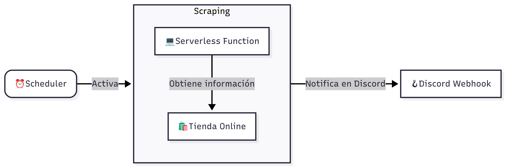
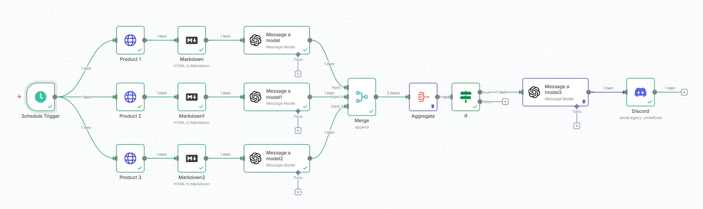
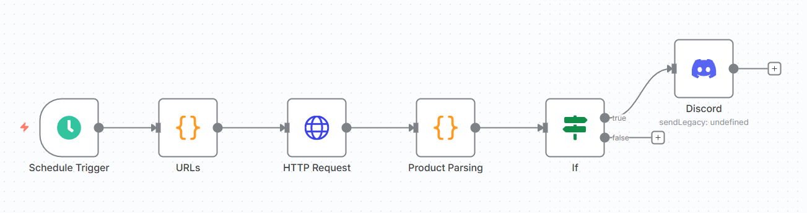
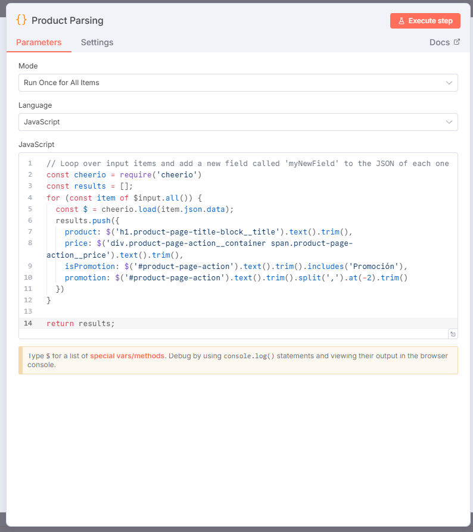

En los últimos meses he observado un auténtico boom de personas hablando sobre automatización. Hoy en día resulta difícil no toparse con publicaciones, artículos o vídeos dedicados a este tema, especialmente sobre una herramienta que ha ganado una enorme popularidad: **n8n**. Gran parte de este contenido destaca la facilidad de uso de la plataforma y cómo permite automatizar procesos de manera sencilla, sin apenas requerir conocimientos técnicos, liberando así tiempo y recursos que pueden destinarse a tareas de mayor valor añadido.

Este fenómeno ha provocado la aparición de un perfil muy concreto: personas que promueven la idea de que las herramientas _low-code_ o _no-code_ permiten a cualquiera, incluso sin formación técnica, automatizar flujos de trabajo de forma eficiente y mejorar su rendimiento. No faltan testimonios de quienes aseguran haber vendido estos flujos por miles de euros, e incluso han surgido agencias cuya actividad gira exclusivamente en torno a este tipo de soluciones.

Como profesional que ha implementado sistemas de automatización en los últimos años, esta tendencia ha despertado mi curiosidad. Quiero entender cómo funciona n8n y compararlo con la implementación manual de sistemas automáticos (aquella que sí requiere conocimientos técnicos) en aspectos como escalabilidad, costes y tolerancia a fallos.

Es evidente que las soluciones técnicas personalizadas ofrecen mayor flexibilidad y control sobre el flujo de automatización. Sin embargo, no todos los casos de uso necesitan ese nivel de precisión o ajuste, y es aquí donde las opciones _low-code_ o _no-code_ pueden ser una alternativa perfectamente válida.

Por ello, en este artículo analizaré un caso de uso sencillo y específico (aunque con posibles aplicaciones empresariales) para evaluar estas diferencias de manera práctica.

# El caso de uso

Tengo un perro desde hace varios años y, como suele ocurrir con muchos perros, es bastante exigente con su alimentación. Básicamente solo come una marca específica de pienso, que complementa con unas chuches muy concretas de determinadas marcas. En definitiva, se puede decir que es un poco exquisito.

Hoy en día los precios son elevados en casi todo, así que cualquier forma de ahorrar siempre es bienvenida. En este caso concreto, su dieta es bastante predecible, lo que me permite anticipar con cierta precisión cuándo voy a necesitar comprar cada producto. A partir de esa idea pensé en crear un sistema que monitorizara los tres productos principales que consume en varias tiendas online y que me avisara en caso de detectar una oferta. Así podría ahorrar unos euros en compras que, de todos modos, iba a realizar.

Con esto en mente, hace seis meses implementé un sistema en Google Cloud que scrapea la información de estos productos en distintas tiendas y me envía una notificación por Discord cuando detecta descuentos. A continuación muestro un diagrama del sistema:

Como se puede ver, utilizo **Cloud Scheduler** para activar una **Cloud Run Function** que realiza el scraping y notifica a través de un webhook de Discord en caso de encontrar ofertas. Durante el desarrollo descubrí que la mayoría de promociones se lanzan a principios de semana y suelen mantenerse varios días, lo que hace innecesario monitorizar a diario. Por ese motivo el proceso se ejecuta únicamente los lunes a las 9 de la mañana.

En estos meses el resultado ha sido un ahorro de unos **30 euros**, con un coste **cero** para mí, ya que toda la arquitectura funciona dentro de la capa gratuita de Google Cloud.

> **Nota:** Aunque casi todas las semanas se detectan ofertas, no siempre se pueden aprovechar. Los productos alimenticios se consumen a un ritmo limitado, por lo que la automatización tiene un techo natural en cuanto al ahorro que puede generar.

# Replicando la solución con n8n

Con este caso de uso en mente, me pregunté cómo podría replicar la misma solución utilizando **n8n**, pero sin necesidad de programar ni contar con conocimientos técnicos avanzados.

Partiendo de esta premisa, revisé vídeos de YouTube y tutoriales creados por personas con el perfil mencionado anteriormente. En muchos de ellos se afirmaba que con n8n es posible implementar prácticamente cualquier solución sin necesidad de código. Una de mis principales dudas era cómo resolverían el problema de **parsear la información** que devuelve una página tras una petición HTTP.

Tras analizar varios casos, descubrí que la respuesta más habitual era delegar esta tarea a la **IA**. En general, lo que se hace es enviarle el HTML completo (o transformado a Markdown) y pedirle que lo transforme en un objeto JSON con la información relevante.

Con esta idea, decidí ponerlo en práctica y el resultado fue el workflow que muestro a continuación:

A simple vista el proceso puede parecer complejo y, en mi experiencia, su implementación tampoco fue trivial. El mayor reto estuvo en **lidiar con las alucinaciones del modelo de IA** y en diseñar prompts que devolvieran únicamente la información del producto que me interesaba.

Un problema recurrente era que, dentro del HTML de una página de producto, suelen aparecer también secciones con artículos relacionados (carruseles, recomendaciones, etc.). Esto hacía que el modelo devolviera un conjunto de datos mucho mayor al que realmente necesitaba. La solución fue explicitar en el prompt que solo debía devolver la información del producto principal.

Cuando intenté procesar varias páginas en paralelo surgió otra dificultad: el modelo identificaba un único producto principal y, por tanto, solo me devolvía información de uno de ellos. Probablemente podría haberse resuelto afinando los prompts, pero opté por una solución más simple: realizar tres llamadas independientes, una para cada producto.

Una vez superados estos obstáculos, la parte final resultó sencilla. Solo fue necesario añadir un par de nodos para procesar los datos, siguiendo la documentación de n8n, y conectar el flujo con el canal de notificaciones.

# Resultados y comparativa

Debo admitir que la implementación con **n8n** me llevó más tiempo que la realizada en **Google Cloud**. Sin embargo, el resultado final funciona correctamente y aporta un matiz interesante: gracias al nodo de IA añadido antes de la notificación, los mensajes enviados por Discord resultan más naturales y atractivos que las plantillas fijas que utilicé en la versión de Google Cloud.

Dicho esto, una automatización solo tiene sentido si genera un beneficio tangible para quien la implementa. En este caso, ese beneficiario soy yo, así que conviene medir la utilidad de manera objetiva.

En seis meses logré un ahorro de unos **30 €**, lo que equivale a unos **60 € al año** en el mejor de los casos. Tomaremos esta cifra como referencia del **valor económico de la automatización**. Si el coste de mantener el sistema supera ese valor, la automatización deja de tener sentido: estaría gastando más de lo que ahorro, convirtiéndose en un proceso autónomo **inútil**.

Si situamos la implementación en **n8n cloud** (una hipótesis razonable, ya que el servicio gestiona el hosting y simplifica la conexión entre herramientas para usuarios no técnicos), el coste mínimo de la suscripción sería:

- **20 € al mes** con pago anual → **240 € al año**.
- **24 € al mes** con pago mensual → **288 € al año**.

En otras palabras, incluso en el mejor de los escenarios, el coste de la suscripción supera con creces el potencial ahorro de 60 € anuales.

A esto se suma el coste del uso de la **API de OpenAI** para parsear el HTML. Enviar el contenido completo de una página de ecommerce implica un número elevado de tokens. Durante mis pruebas, el gasto fue de unos **0,06 €**, una cifra baja, pero que podría crecer rápidamente si el sistema escalara a un número mayor de páginas.

Con estos resultados se pone de manifiesto un problema real en las aseveraciones de quienes defienden que cualquiera puede montar un sistema autónomo sin necesidad de conocimientos técnicos. Si bien esto es cierto en términos de **funcionalidad**, no refleja la realidad completa de los procesos autónomos. Como he mencionado, un sistema de este tipo solo es tan valioso como los beneficios que genera, ya sea en tiempo o en dinero.

Es posible obtener un sistema operativo sin escribir una sola línea de código, pero también es cierto que, en muchos casos, el resultado no es eficiente y puede acabar generando más costes que beneficios. A ello se suma un problema adicional: la **escalabilidad y el mantenimiento a largo plazo**, especialmente cuando se delegan tareas críticas (como el parseo del HTML) en un modelo de IA.

El riesgo no solo está en el aumento potencial de costes, sino en los **errores de interpretación** o **alucinaciones** de la IA que pueden dar lugar a falsos positivos. En un sistema reducido, como el mío, con tres productos, un error puntual no supone un gran problema. Pero si hablamos de un sistema que gestione cientos o miles de productos, detectar esos fallos se vuelve mucho más difícil y podría derivar en decisiones erróneas en un contexto empresarial.

# Bonus track: n8n con código mínimo

No me parecía justo finalizar el artículo dando la impresión de que **n8n** es una mala solución o una herramienta poco útil. Nada más lejos de la realidad. El objetivo de este texto es señalar algunos problemas en las afirmaciones de quienes sostienen que el conocimiento técnico ya no es necesario. En realidad, n8n es una herramienta muy versátil y tremendamente útil para la creación de sistemas autónomos, especialmente cuando se combina con experiencia previa en automatización de procesos y programación.

Tras crear el primer flujo quise experimentar con una versión que aprovechara el verdadero potencial de la herramienta, sin limitarme a evitar cualquier uso de código. El resultado fue el workflow que muestro a continuación:

Como puede verse, el proceso es mucho más simple que el planteado anteriormente y no requiere el uso de IA. Su implementación me llevó apenas **15 minutos** (considerablemente menos que la versión de Google Cloud) y permite replicar exactamente el mismo flujo.

El “truco” está en usar dos nodos de código: uno para gestionar las URLs que quiero scrapear y otro para procesar el HTML. Una vez hecho esto, si detecto que algún producto está en oferta, el sistema notifica vía Discord con un mensaje plantilla. Podría añadir un nodo de IA para generar mensajes más originales, pero no es necesario y así mantengo el coste a 0.

En la siguiente captura puede verse la configuración del nodo de código que realiza el parseo del HTML. Como se aprecia, es bastante sencillo y cualquier persona con conocimientos básicos de HTML y JavaScript podría implementarlo:

Este enfoque demuestra lo potente que puede ser n8n: permite una implementación rápida, flexible y con **coste cero** si se opta por instalar la herramienta en un servidor propio. Es la solución que utilizo actualmente, y al igual que en Google Cloud, no me supone gastos de mantenimiento. Además, n8n facilita mucho la evolución del sistema, ya que hacer cambios en el flujo es más simple que tener que redesplegar un pipeline en la nube.

Eso sí, esta opción no es adecuada para todo el mundo. Requiere ciertos conocimientos técnicos (gestión de servidores, uso de Docker y algo de programación) que pueden ser un obstáculo para usuarios completamente no técnicos.

# Conclusiones

A lo largo del artículo he mencionado varias veces una idea que considero fundamental: **la automatización no es valiosa por sí misma, sino en la medida en que aporta beneficios reales a quien la implementa**. Es fácil perder de vista este detalle con tanta publicación y vídeo en los que se muestra cómo alguien automatizó un proceso, pero sin explicar el valor que realmente generó. En mi caso, automatizar un proceso con un coste de 240 € para ahorrar solo 60 € no sería un buen negocio. Sin embargo, este aspecto rara vez se analiza, y por eso me pareció interesante escribir este artículo.

El objetivo era poner de relieve que el **conocimiento técnico sigue siendo útil y necesario**, incluso frente a herramientas tan potentes como n8n y a las posibilidades que ofrecen los modelos de inteligencia artificial. Sin alguien que piense en eficiencia, costes y escalabilidad, corremos el riesgo de terminar con procesos autónomos que, lejos de beneficiarnos, generan más gastos y resultan poco útiles.

Desde mi punto de vista, la mejor solución fue aquella que combina **n8n con un mínimo de conocimientos técnicos**. Esta estrategia permite aprovechar al máximo el potencial de la herramienta y crear un proceso que, además de ser eficiente, tiene un coste reducido y promete generar ahorros más significativos en el futuro.
