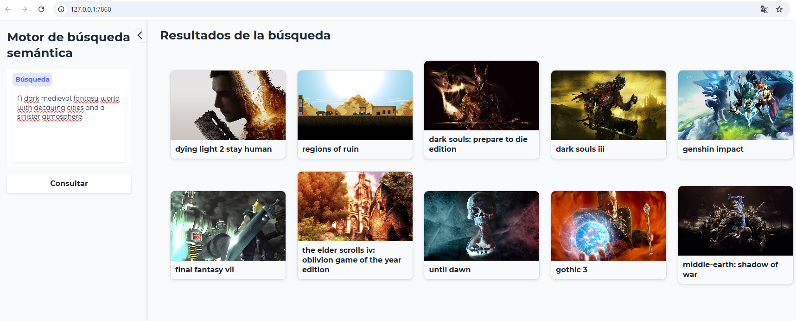

Como habréis notado en artículos anteriores, me interesa profundamente la inteligencia artificial. Pero lo que realmente me fascina es su aplicación práctica. En publicaciones previas ya he mostrado que disfruto experimentando y analizando lo que la tecnología puede hacer realmente, más allá del humo y el hype.

Cuando, como en mi caso, investigas y experimentas con inteligencia artificial, tarde o temprano te topas con el concepto de **embedding**. Para no entrar en discusiones demasiado abstractas, podemos simplificar diciendo que los embeddings son representaciones numéricas de datos complejos, como texto o imágenes. De hecho, son la base fundamental de los modelos de lenguaje que usamos habitualmente, como Gemini o GPT.

Estos embeddings, aplicados al texto, permiten capturar la información semántica compleja propia del lenguaje y representarla de manera numérica. Se utilizan tanto dentro de los modelos de lenguaje como en aplicaciones de tipo RAG (Retrieval-Augmented Generation). Estas aplicaciones se basan en realizar búsquedas sobre un conjunto de embeddings para encontrar los que sean semánticamente más cercanos al vector de entrada, proporcionando así al modelo un contexto más adecuado para generar una respuesta.

Al estudiar cómo implementar un sistema RAG para un chat, me di cuenta de que el propio buscador podía ser una aplicación muy interesante. Seguro que os ha pasado: hay libros que habéis leído o películas que habéis visto que os han encantado, y os gustaría encontrar cosas similares. Pero no me refiero a similitudes basadas en puntuaciones de otras personas “con gustos parecidos a los míos”. Me refiero a similitudes argumentales o de contenido.

A raíz de esto, pensé: ¿por qué no usar un sistema de búsqueda vectorial sobre las sinopsis de los libros para buscar por descripciones textuales libros similares? Por ejemplo, en lugar de buscar por autor, título o género, podrías introducir un texto que represente lo que estás buscando: algo como _“historias de fantasía medieval ambientadas en mundos oscuros y con tramas políticas complejas”_. El sistema devolvería libros cuya sinopsis encaje a nivel de similitud con esa búsqueda. Una recomendación aceptable en este caso sería, por ejemplo, _Juego de Tronos_.

Como podéis ver, la gracia está en que no es necesario mencionar al autor ni el título: el sistema devuelve resultados basándose únicamente en la similitud con lo que estamos buscando. A partir de esta idea, me puse a pensar en lo viable y lo complicado que sería implementar algo así, y el resultado es este artículo.

# El drama de los datos

Para implementar el sistema, lo primero que necesitaba era una cantidad razonable de datos con suficiente información textual para realizar las búsquedas. Mi primera idea, como mencioné antes, era recopilar información sobre una cantidad significativa de libros y montar un sistema de búsqueda semántica basado en sus sinopsis. Sin embargo, pronto descubrí que no existen tantos lugares que permitan obtener datos de libros de manera fácil y pública. Existen proyectos como Google Books API y OpenLibrary, pero, en mi opinión, están más orientados a obtener información sobre un libro en particular que a recopilar grandes volúmenes de datos de golpe para montar un sistema.

Otra opción hubiera sido recurrir al web scraping. A pesar de que hice un pequeño intento, algunas de las principales librerías online protegen su información como si fuera el santo grial. Si bien la obtención era posible, me habría obligado a invertir mucho más tiempo del que estaba dispuesto a dedicar.

Por tanto, decidí cambiar de sector y buscar otra fuente de datos que fuera accesible y permitiera obtener un conjunto de información de manera sencilla. En esta búsqueda me encontré con **RAWG Video Games Database**. RAWG mantiene una base de datos de videojuegos muy completa y permite su acceso y distribución de forma sencilla a través de una API muy bien documentada. Además, ofrecen un nivel gratuito generoso que permite hasta 20.000 consultas mensuales para proyectos personales.

Quiero aprovechar este momento para dar **reconocimiento y atribución a RAWG** por mantener y distribuir esta información de manera pública y accesible. Gracias a su trabajo, proyectos como este son posibles, y su API gratuita hace que experimentar y desarrollar sea mucho más viable.

Con la decisión sobre los datos tomada, procedí a usar la API de RAWG para obtener un conjunto de datos de tamaño razonable para montar el sistema. Tras las consultas, conseguí información sobre 800 videojuegos, incluyendo: identificador único en RAWG, título, sinopsis, publisher, año de lanzamiento, géneros y una imagen. Esta información es suficiente para lo que quería hacer; de hecho, desde un punto de vista técnico, con el título y la sinopsis sería suficiente. Pero tener los otros campos podría ser útil en caso de que quisiera implementar un sistema de prefiltrado basado en alguno de ellos.

> Nótese que la información que recuperé representa solo una pequeña parte de lo que RAWG pone a disposición.

Con los datos en local, estaba listo para empezar a implementar el sistema.

# El sistema de búsqueda semántica

Implementar un sistema de búsqueda semántica es relativamente sencillo si cuentas con tres cosas:

1. Un conjunto de datos con el que trabajar.
2. Un sistema para generar embeddings lo suficientemente bueno como para que realmente funcionen.
3. Una base de datos que permita realizar búsquedas sobre estos embeddings de forma eficiente.

Con el primer punto resuelto (aunque con más trabajo del esperado), quedaban por solucionar los otros dos.

Hoy en día, encontrar sistemas para generar embeddings es bastante sencillo: casi todos los proveedores de LLM, como OpenAI, ofrecen algún endpoint vía API para generar embeddings de texto, precisamente para facilitar la creación de herramientas tipo RAG. No obstante, en este caso decidí recurrir a Hugging Face y, en particular, a un modelo gratuito llamado _all-MiniLM-L6-v2_. Este modelo permite generar embeddings sobre cadenas de texto de manera gratuita y es tan eficiente que incluso en mi ordenador, que carece por completo de una tarjeta gráfica decente, funciona muy rápido.

Es importante mencionar que este modelo presenta algunas limitaciones relacionadas con la longitud del texto que se puede introducir. Según indica la tarjeta del modelo, el texto está limitado a un máximo de 256 palabras. A partir de ahí, el modelo trunca el contenido, por lo que, si la información relevante se encuentra al final de la cadena, los resultados podrían no ser óptimos. Por supuesto, existen maneras de subsanar este problema, como dividir el texto en trozos más pequeños y calcular un promedio de los embeddings para obtener una representación única del videojuego. Sin embargo, esto escapa al objetivo de este artículo.

Con los embeddings creados, solo quedaba volcarlos en una base de datos que permitiera realizar consultas de forma eficiente. Actualmente, gracias al auge de las aplicaciones de inteligencia artificial, existen múltiples bases de datos optimizadas específicamente para este tipo de tareas, como Pinecone, Weaviate o Chroma. También existen otras bases de datos que, aunque no fueron diseñadas originalmente con este propósito, han incorporado funcionalidades que permiten trabajar con este tipo de metodología. Este es el caso de Elasticsearch, que fue la opción por la que finalmente me decanté.

Elasticsearch es un motor de búsqueda distribuido que permite encontrar información de forma muy rápida en grandes volúmenes de datos. Se utiliza habitualmente para búsquedas de texto completo y ha incorporado un tipo de dato llamado **dense vector**, que sirve precisamente para indexar información de embeddings y realizar búsquedas vectoriales de manera eficiente. Además, permite realizar búsquedas mediante un modelo RESTful, como si se tratara de una API, lo que implica que la aplicación resultante no necesita dependencias específicas para ejecutar consultas sencillas.

Y, por último, siendo honestos: me apetecía probarlo y esta me pareció una buena oportunidad para hacerlo.

# La aplicación

Con los datos ya volcados en la base de datos, solo quedaba consultarlos y ver los resultados. Para ello, como mencioné antes, basta con realizar una sencilla consulta tipo API. No obstante, el resultado inicial era bastante poco vistoso, así que pensé: _¿por qué no hacerle una pequeña interfaz gráfica?_

Para ello decidí usar **Gradio**, con el que creé una interfaz como la que se muestra a continuación.

Como se puede ver, la interfaz no destaca por su diseño (no es precisamente su punto fuerte), pero siendo sincero, el diseño visual no es lo mío. La idea era simplemente disponer de una pequeña aplicación que me permitiera introducir un texto para la búsqueda y mostrar los resultados de manera clara. Para esos objetivos, la demo que muestro en la captura de pantalla es más que suficiente.

Con el sistema ya montado, me puse a probarlo para ver qué tan buenos eran los resultados. La primera impresión fue una pequeña decepción: los resultados eran mediocres. No se puede decir que fueran totalmente malos, pero parecía que el modelo no captaba bien las relaciones semánticas entre lo que yo le pedía y lo que había en la base de datos.

Por ejemplo, si solicitaba _“juegos de estrategia bélica ambientados en universos de ciencia ficción”_, me devolvía títulos con alguna relación tangencial con la ciencia ficción, pero no del todo pertinentes. Era como si el sistema no terminara de entenderme.

Durante un par de días estuve dándole vueltas a qué podía estar fallando y cómo mejorar el modelo. Incluso llegué a plantearme relanzar todo el proceso usando _embeddings_ más potentes, como los de OpenAI, aunque fueran de pago.

Hasta que, de repente, me di cuenta de lo que estaba pasando: estaba haciendo las consultas en español, mientras que las sinopsis que había convertido en _embeddings_ e indexado en Elasticsearch estaban en inglés.

Volví a probar el sistema, esta vez escribiendo las consultas en inglés, y los resultados mejoraron exponencialmente. Se convirtieron justo en lo que esperaba.

Adjunto una captura de pantalla de una búsqueda de ejemplo con el texto:

> “A dark medieval fantasy world with decaying cities and a sinister atmosphere.

Hice la consulta pensando en el juego **Dark Souls**, y como se puede ver en la captura, aparecen dos de sus entregas entre los resultados. Me tomé la libertad de revisar algunos de los otros juegos y, en general, los resultados me parecen bastante buenos. No todos tienen una ambientación medieval, pero el sistema sí ha captado perfectamente la atmósfera decadente y siniestra.

Podría haber ocultado este fallo en la primera versión y decir que el sistema funcionó perfectamente desde el principio. Pero me pareció relevante comentarlo por dos motivos.

El primero es que es fácil pensar que los _embeddings_ son multilingües, cuando en realidad, aunque existen modelos que lo son, no es el estándar. Por tanto, conviene tener siempre presentes las limitaciones del modelo para implementarlo de forma correcta.

En mi caso, opté por la solución perezosa: traducir la consulta al inglés y luego realizar la búsqueda. Sin embargo, se podría implementar un sistema de traducción automática que convierta el texto introducido por el usuario al inglés antes de lanzar la consulta. En general, me parece una buena idea, ya que la mayoría de los modelos de _embeddings_ funcionan mejor en inglés, incluso cuando están preparados para otros idiomas.

La segunda lección que saqué de todo esto es que muchas veces creemos que pagando obtendremos mejores resultados (como me pasó al pensar en usar los modelos de OpenAI), cuando en realidad la solución que tenemos ya es válida, simplemente no la estamos utilizando bien. En ocasiones, no se trata de sacar la cartera, sino de entender mejor las herramientas que usamos.

# Conclusiones

La creación de esta aplicación me ha resultado especialmente gratificante. Creo que la razón es que utiliza la tecnología para algo que me parece verdaderamente útil: descubrir nuevo contenido similar al que ya me ha gustado. Puede parecer sencillo encontrar más series, libros o videojuegos parecidos a otros que nos interesan, sobre todo con la cantidad de sistemas de recomendación disponibles en la web. Sin embargo, cualquiera que lo haya intentado se habrá topado, como yo, con listas interminables basadas en puntuaciones de otros usuarios o en recopilaciones genéricas del tipo _“los 10 mejores libros de la mafia”_, donde los títulos se repiten una y otra vez, solo cambiando el orden.

Otro de los motivos por los que me ha gustado este proyecto es que se apoya en una tecnología relativamente olvidada a pesar de su sencillez. He implementado el sistema en un par de fines de semana (obviamente es un proyecto de juguete, pero una prueba de concepto al fin y al cabo) y la mayor parte del tiempo se fue en obtener los datos. Además, este tipo de sistema es aplicable a muchos otros sectores y niveles. Por ejemplo, podría utilizarse en un _e-commerce_ para realizar búsquedas sobre las descripciones de los productos. También existen modelos como CLIP que permiten convertir imágenes en _embeddings_ y realizar búsquedas de texto sobre ellas, algo especialmente útil para explorar bancos de imágenes muy grandes mediante conceptos complejos, más allá de simples etiquetas como “foto del mar en la playa”. Quiero pensar que muchas aplicaciones ya funcionan así, aunque la realidad es que en mi día a día me encuentro con más buscadores que se bloquean ante una falta de ortografía que con los que aplican este tipo de técnicas.

Otra reflexión importante es que, como todas las aplicaciones basadas en datos, el resultado obtenido es tan bueno como los datos de partida. En este caso, una de las principales limitaciones ha sido que las sinopsis no siempre son lo suficientemente descriptivas o detalladas como para generar _embeddings_ con una riqueza semántica adecuada. Aun así, es un problema relativamente fácil de solventar añadiendo descripciones más completas o incorporando más información disponible. Por ejemplo, muchas editoriales publican una muestra del libro para que los lectores puedan echarle un vistazo; este contenido adicional podría incluirse para enriquecer los _embeddings_.

Por último, quiero terminar el artículo comentando que, por primera vez, he creado una demo disponible en Google Colab para que podáis probar el sistema vosotros mismos. Solo necesitaréis una clave de API de RAWG para obtener los datos (es gratuita, como ya mencioné antes). El sistema en Colab funciona de manera algo distinta, ya que no es posible lanzar una instancia de Elasticsearch dentro del entorno, así que lo implementé con Chroma, que permite crear una base de datos local para este tipo de búsqueda. De paso, me sirvió para comparar ambas soluciones. Os dejo a continuación el enlace a la demo junto con otros enlaces de interés, por si queréis probarla.

# Enlaces:

- [Enlace a la demo](https://colab.research.google.com/drive/1pFcRF1X8zlKvJT2ZhIn2DncuTOHq6DrI?usp=sharing)
- [RAWG API](https://rawg.io/apidocs)
- [Tarjeta modelo embeddings all-MiniLM-L6-v2](https://huggingface.co/sentence-transformers/all-MiniLM-L6-v2)
- [CLIP](https://openai.com/es-ES/index/clip/)
- [Chroma](https://docs.trychroma.com/docs/overview/getting-started)
