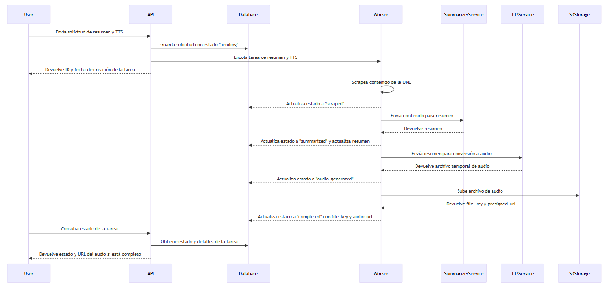

Cuando empiezo un proyecto personal suelo ponerme dos condiciones:

1. Que me resulte útil o resuelva una necesidad.
2. Que me permita aprender algo nuevo.

Las ideas no siempre nacen de ambos puntos a la vez, pero intento que al menos terminen cumpliéndolos. Hace un par de meses me apetecía profundizar en cómo montar un sistema backend con una API en **FastAPI**, uno de los frameworks más populares de Python hoy en día. Ya había hecho algunos proyectos de prueba con esta tecnología, pero quería ir un paso más allá: introducir la gestión asíncrona de tareas, trabajar la dockerización del sistema y, en general, darle un enfoque más realista.

En este caso, primero tenía claro el _stack_ con el que quería practicar; lo que me faltaba era encontrar un uso concreto. Pensando en problemas cotidianos, me di cuenta de que a lo largo de la semana guardo muchos artículos y noticias interesantes que casi nunca termino de leer. La atención es un recurso escaso, y un título llamativo no garantiza que el contenido merezca la pena. De ahí surgió la idea: ¿y si montaba un sistema que resumiera artículos?

El resumen solucionaba parte del problema, pero no del todo: seguía teniendo que sentarme a leerlos. Así que le di una vuelta más. Soy oyente habitual de podcasts y audiolibros, me acompañan mientras paseo o hago ejercicio. Entonces pensé: ¿y si los artículos se resumieran y se transformaran en pistas de audio?

La idea conectaba además con algo que ya había explorado en mi artículo sobre accesibilidad: allí mencionaba cómo tecnologías como **ElevenLabs** permiten convertir texto en voz y abrir nuevas posibilidades de consumo de información. En este proyecto decidí integrarlo directamente: el sistema recibe una URL, extrae el contenido, lo resume con un modelo de IA y finalmente lo convierte en audio.

Este artículo cuenta cómo monté ese proyecto y qué resultados obtuve en el proceso.

# El stack

Antes de ponerme con la arquitectura tenía claro qué tecnologías quería probar. El objetivo era practicar con herramientas actuales del ecosistema Python y, a la vez, resolver el problema de forma eficiente. El _stack_ quedó así:

- **FastAPI** → para construir la API del backend.
- **Celery** → para ejecutar tareas pesadas en segundo plano.
- **Gemini API** → para generar los resúmenes de texto.
- **ElevenLabs API** → para convertir los resúmenes en audio.
- **PostgreSQL** → para registrar estados y resultados de las tareas.
- **S3** → para almacenar los archivos de audio generados.
- **Docker** → para contenerizar y desplegar el sistema fácilmente.

Con estas piezas montadas, pasemos a ver cómo encajan entre sí dentro de la arquitectura.

# La arquitectura

Este artículo no pretende ser una explicación técnica en profundidad del sistema. Para quien quiera entrar en detalle, todo el código está disponible en mi repositorio de GitHub (enlace aquí). Lo que sigue es una visión de alto nivel de cómo funciona el proyecto.

El usuario interactúa con una **API**, que actúa como punto de entrada (una interfaz gráfica haría la experiencia más cómoda, pero eso sería otro proyecto). Cuando se envía una URL mediante una petición **POST**, la API realiza tres acciones:

1. Guarda la solicitud en la base de datos con estado `pending`.
2. Encola la solicitud en un _worker_ de **Celery**, que será el encargado de procesarla.
3. Devuelve al usuario el ID de la solicitud. A partir de ahí, el usuario es libre de encolar más tareas o cerrar la aplicación: no necesita esperar.

Una vez que el _worker_ recibe la tarea, el flujo se divide en cuatro pasos:

1. **Scraping** → obtiene el contenido de la URL, actualiza el estado de la tarea a `scraped` en la base de datos y devuelve el texto al _worker_.
2. **Resumen** → el texto se envía a la API de **Gemini**, que genera un resumen. El sistema lo guarda en la base de datos junto con el estado `summarized` y lo devuelve al _worker_.
3. **Generación de audio** → el resumen se envía a **ElevenLabs**, que devuelve un archivo temporal con la pista de audio. La base de datos se actualiza con el estado `audio_generated`.
4. **Almacenamiento** → el archivo se sube a un bucket de **S3**. Se marca la tarea como `completed`, se guarda la clave del archivo y se genera una _presigned URL_ para que el usuario pueda descargarlo sin necesidad de acceso directo al bucket.

Además, el sistema guarda trazabilidad de los errores y registra métricas como el tiempo que tarda cada flujo en completarse. Esto permite tener cierta **observabilidad** sobre la ejecución y facilita detectar cuellos de botella.

El siguiente diagrama resume el proceso completo:

Lo más interesante de este diseño es el uso de tareas **asíncronas** con Celery. Esta decisión viene de una obsesión particular con la eficiencia: en lugar de obligar al usuario a esperar en una pantalla bloqueada mientras se completa el trabajo (que en algunos casos puede tardar hasta un minuto), el sistema devuelve enseguida un ID con el que consultar el estado más tarde.

De esta forma, la API queda desacoplada del procesamiento, el usuario mantiene la sensación de inmediatez y puede seguir trabajando o lanzar más peticiones. Además, al registrar el avance en distintos estados (`scraped`, `summarized`, `audio_generated`, `completed`), el sistema no solo avanza de forma ordenada, sino que también informa al usuario de dónde está su tarea en cada momento.

En la práctica, esto marca la diferencia entre una aplicación usable y otra frustrante. Y aunque aquí lo aplico en un proyecto personal, en sistemas productivos la asincronía y la distribución de tareas son piezas clave que merecerían un artículo aparte.

# Los resultados

Con todo el sistema montado sobre Docker, el despliegue en un VPS fue relativamente sencillo y pude probarlo durante un tiempo. Gracias a las capas gratuitas de **ElevenLabs** y la **API de Gemini**, logré generar resúmenes y audios de unas veinte piezas entre artículos y noticias, aunque con las limitaciones propias de esos planes gratuitos.

El sistema funcionaba tal como esperaba: recibía un artículo, generaba un resumen y lo convertía en audio que podía escuchar antes de decidir si leerlo completo o no. En esta primera versión solo podía reproducirlo desde el ordenador, aunque no costaría mucho evolucionar el proyecto hacia algo más práctico en móvil (con una pequeña interfaz, por ejemplo).

Más allá del aprendizaje técnico, lo que me pareció realmente interesante fue la **reflexión que el sistema me provocó**. En la práctica estaba delegando una tarea cognitiva a una máquina: leer un texto, decidir qué era importante y qué no, y devolverme una versión destilada en formato audio. Todo el contenido pasaba por el filtro de un modelo de IA, en este caso Gemini.

Esto me llevó a pensar en los **sesgos y la pérdida de matices**. Un resumen, por definición, implica comprimir la información: siempre se deja algo fuera. Cuando lo hace una persona, esa selección está influida por su cultura, creencias y experiencias. En los modelos de IA, no existen creencias en sentido humano, pero sí hay sesgos derivados de los datos de entrenamiento. Que ahora esa tarea la realice un sistema automatizado introduce un cambio cualitativo que, como sociólogo de formación, me resulta especialmente llamativo.

Durante las pruebas confirmé que los resultados eran bastante buenos: los resúmenes captaban lo esencial, aunque en ocasiones sacrificaban matices interesantes. También observé que la **aleatoriedad de los modelos generativos** no generaba grandes variaciones entre ejecuciones con la configuración que utilicé: lo que aparecía como importante en una ejecución solía repetirse en otras. Tampoco encontré problemas de “alucinaciones” en este caso de uso (Gemini y ElevenLabs), lo que me dejó bastante sorprendido por la solidez de la solución.

# Conclusiones

Mi experiencia con este proyecto me ha mostrado que la forma de consumir información probablemente ha cambiado de manera significativa. No comparto la visión de muchos gurús que afirman que la IA generativa “lo va a cambiar todo”: al fin y al cabo, son modelos **probabilísticos** que predicen la siguiente palabra más probable, y eso hay que tenerlo presente. Como cualquier sistema, tienen limitaciones importantes, especialmente en términos de fiabilidad y costes de implementación y mantenimiento. Sin embargo, su capacidad para automatizar ciertas tareas cognitivas sí representa un cambio real en la forma de procesar información.

Está claro que son herramientas muy poderosas, capaces de permitir cosas que antes habrían sido impensables. Este caso de uso demuestra que, en tareas concretas, los modelos ofrecen soluciones **sólidas y consistentes**, aunque no exentas de limitaciones.

Los posibles casos de uso son muy variados. Van desde sistemas de resumen de contenido, como el que he desarrollado, hasta aplicaciones que mejoren la **accesibilidad**. Y no me refiero únicamente a que herramientas como ElevenLabs permitan generar pistas de audio de alta calidad para personas con problemas visuales. También hablo de **accesibilidad cognitiva**: la capacidad de los modelos de vanguardia para generar resúmenes consistentes indica que podrían ayudar a las personas a comprender mejor la información, filtrando lo esencial y facilitando su procesamiento. Es importante recordar que esto es un potencial y que los modelos pueden presentar sesgos derivados de sus datos de entrenamiento, por lo que conviene evaluar cuidadosamente su aplicación.

En definitiva, este proyecto invita a reflexionar sobre cómo toda automatización conlleva decisiones sobre **qué consideramos relevante**, y que esos filtros (ya sean humanos o tecnológicos) siempre introducen sesgos y limitaciones. La combinación de eficiencia técnica y reflexión crítica permite diseñar sistemas que no solo funcionan bien, sino que también nos ayudan a pensar de forma más consciente sobre cómo consumimos y valoramos la información.
