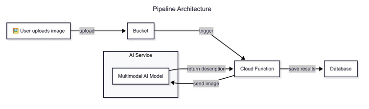

# Introducción

En los últimos años he tenido la oportunidad de trabajar en el ámbito del negocio digital con empresas de distintos tamaños. A lo largo de este tiempo, he observado cómo muchas de ellas se sitúan a la vanguardia en el uso de la tecnología para mejorar sus productos, servicios o incrementar la eficiencia operativa. Sin embargo, también he identificado una deuda común y persistente: la accesibilidad.

La accesibilidad consiste en un conjunto de buenas prácticas y procesos destinados a garantizar que las personas con discapacidades puedan acceder y utilizar los servicios digitales en igualdad de condiciones. No se trata únicamente de una cuestión ética, sino también de un aspecto con importantes implicaciones económicas y legales para las empresas. No es solo que se esté excluyendo, aunque sea de forma involuntaria, a potenciales clientes; también existen marcos normativos, como la _European Accessibility Act_ en Europa, que imponen sanciones a las organizaciones que no cumplan con los requisitos de accesibilidad establecidos.

En muchos casos, he observado que las deficiencias en la implementación de la accesibilidad digital no se deben a una falta de interés o descuido por parte de los responsables de las empresas, sino a los desafíos de escalabilidad asociados al alto volumen de contenido que un negocio digital genera de forma continua. Esta situación hace que incorporar y mantener prácticas de accesibilidad resulte complicado, especialmente en un entorno donde la velocidad y la capacidad de adaptación al mercado son claves para seguir siendo competitivo. Sin embargo, el auge de nuevas tecnologías, como la inteligencia artificial generativa, abre una oportunidad para optimizar estos procesos y permitir que las empresas puedan cumplir con los requisitos de accesibilidad de forma más ágil, eficiente y escalable.

Este artículo nace de un interés personal por explorar cómo la inteligencia artificial, combinada con procesos automatizados en plataformas de _cloud computing_, puede contribuir a que la generación de contenido accesible sea menos costosa y más escalable. El objetivo es avanzar hacia una web más inclusiva sin que ello suponga una carga excesiva para los equipos de desarrollo.

En particular, me centraré en uno de los aspectos que considero simultáneamente más problemáticos y más abordables: la generación de textos alternativos descriptivos para las imágenes en una web. Si bien existen herramientas que intentan resolver este problema, muchas de ellas lo hacen de forma reactiva (una vez que el contenido ya ha sido publicado) o dependen de servicios de terceros sobre los que se tiene un control limitado, lo que introduce barreras adicionales para su adopción e integración en los flujos de trabajo existentes.

Mi propuesta consiste en desarrollar un pipeline automatizado, orientado a la prevención más que a la corrección, que facilite la integración de buenas prácticas de accesibilidad desde el inicio del proceso de generación de contenido.

# La accesibilidad en cifras

Según la Organización Mundial de la Salud (OMS), en el mundo hay aproximadamente 2.200 millones de personas con algún tipo de deficiencia visual. Además, el propio informe destaca que la edad es un factor determinante, lo cual, en un contexto de envejecimiento global de la población, sugiere que estas cifras tenderán a aumentar con el tiempo. Una conclusión evidente es que, si vivimos lo suficiente, es probable que todos experimentemos algún grado de pérdida de visión. Esto refuerza la idea de que la accesibilidad digital no debería ser solo una preocupación para las empresas o los desarrolladores, sino también una prioridad para nosotros como consumidores y usuarios de servicios digitales.

Con estas cifras en mente, vale la pena considerar otro dato relevante. El _WebAIM Million Report_ analiza anualmente el nivel de cumplimiento de las Pautas de Accesibilidad para el Contenido Web (_Web Content Accessibility Guidelines_, WCAG) en las páginas principales del millón de sitios más visitados de Internet. Los resultados de 2025 muestran que el 94,8 % de estas páginas no cumplen con los estándares establecidos por el WCAG. La situación resulta aún más preocupante si se tiene en cuenta que esta evaluación se realiza mediante herramientas automatizadas que no detectan ciertos problemas, algo sobre lo que profundizaré más adelante, lo que sugiere que el nivel real de incumplimiento podría ser incluso mayor.

Como podemos ver, el problema es real y está ampliamente extendido. Es cierto que muchos de estos sitios presentan múltiples deficiencias en términos de accesibilidad, pero, como comenté anteriormente, me centraré en un caso particular que considero especialmente preocupante y que, además, puede suponer un verdadero quebradero de cabeza para muchos negocios: las imágenes. Este enfoque no solo permite abordar un aspecto crítico de la accesibilidad digital, sino que también me da la oportunidad de profundizar en uno de los puntos clave señalados por el _WebAIM Million Report_: las limitaciones de las herramientas automatizadas para detectar correctamente el cumplimiento real de los estándares.

# El problema de las imágenes

Según las distintas normativas de accesibilidad, para que una imagen se considere accesible debe ir acompañada de un texto alternativo que describa adecuadamente lo que muestra. En el contexto de una página web, este texto se incorpora mediante el atributo `alt` de la etiqueta `img` en HTML. Este atributo permite que, cuando un lector de pantalla alcanza una imagen, lea en voz alta su descripción, asegurando así que las personas con discapacidad visual no se pierdan parte del contenido. Al fin y al cabo, si el diseñador ha incluido esa imagen, es porque considera que aporta significado o refuerza el mensaje que se quiere transmitir al usuario.

A simple vista, este sistema puede parecer sencillo de implementar, pero la percepción cambia al trasladarlo a la escala real de un negocio digital. Como usuarios, rara vez pensamos en esa dimensión. Imaginemos, por ejemplo, un _ecommerce_ que gestiona cientos de imágenes de producto, o un medio digital que acompaña cada artículo con una o varias fotografías. Si consideramos la cantidad de contenido visual que se genera y publica a diario, rápidamente se hace evidente la magnitud del reto: mantener textos alternativos descriptivos y consistentes en todos los casos no es trivial.

Como resultado, muchas imágenes terminan sin texto alternativo o con descripciones inútiles: el nombre del archivo, una cadena alfanumérica o un texto genérico como _image123.png_. En una auditoría de accesibilidad, este tipo de errores son habituales. Lo preocupante es que, desde el punto de vista de las herramientas automatizadas, estas imágenes pueden considerarse “accesibles” simplemente porque el atributo `alt` está presente, sin evaluar si el contenido del texto cumple realmente su función descriptiva. Es a este tipo de problemas a los que se refiere el informe de WebAIM.

Por suerte, la aparición de modelos de inteligencia artificial generativa multimodal abre una nueva posibilidad: obtener descripciones bastante precisas de forma totalmente automática.

# El pipeline

## El sistema de almacenamiento

Cuando empecé a pensar en cómo la inteligencia artificial podía resolver este problema, me di cuenta de que la cuestión clave no era si los modelos eran capaces de generar descripciones precisas de las imágenes. Esa viabilidad es fácil de comprobar: basta con subir una imagen a herramientas como ChatGPT o similares y pedir una descripción. En muchos casos, los resultados son sorprendentemente buenos.

Por tanto, el verdadero desafío no estaba en la generación del texto, sino en cómo construir un sistema que automatizara este proceso y, sobre todo, que fuera escalable y mantenible en el tiempo.

Aquí es donde entra en juego el _cloud computing_. Casi todas las plataformas en la nube ofrecen servicios de almacenamiento de objetos (como Amazon S3, Azure Blob Storage o Google Cloud Storage) que permiten guardar archivos e información no estructurada de forma económica, segura y con alta disponibilidad. Además, estos sistemas suelen permitir exponer los archivos públicamente, lo que los convierte en una opción habitual para servir imágenes en páginas web.

Esto los hace especialmente adecuados para centralizar y gestionar grandes volúmenes de imágenes, como las que se generan en medios digitales, _ecommerce_ o cualquier otro negocio con una presencia visual significativa en la web.

Con esto, tenemos el primer componente del pipeline: el sistema de almacenamiento.

## La función _serverless_

El siguiente paso del sistema es ejecutar el código que generará automáticamente la descripción de la imagen. Para ello, aprovechamos otro de los grandes servicios que ofrecen las plataformas cloud: la computación _serverless_.

Este paradigma permite ejecutar código sin necesidad de gestionar servidores ni infraestructura subyacente. Una de las opciones más comunes son las funciones _serverless_, que permiten definir pequeñas unidades de lógica que se ejecutan en respuesta a eventos específicos. Precisamente esto es lo que necesitamos.

En la mayoría de plataformas, los sistemas de almacenamiento de objetos pueden actuar como desencadenantes (_triggers_) de estas funciones. Por ejemplo, cuando un usuario sube una nueva imagen al _bucket_, se lanza automáticamente la función correspondiente.

Así, tenemos el segundo componente del pipeline: una función _serverless_ que se activa al detectar un nuevo archivo, procesa la imagen, la envía a un modelo multimodal de IA y genera una descripción adecuada.

Solo falta el último paso: encontrar una forma eficiente de disponibilizar la descripción generada para que los desarrolladores puedan incorporarla fácilmente en sus páginas web.

## Bases de datos

Los principales proveedores de servicios en la nube ofrecen también sistemas de bases de datos donde podemos almacenar los resultados generados por el modelo.

La idea es sencilla: al finalizar la ejecución de la función _serverless_, guardamos en la base de datos un documento que contenga, como mínimo, la ruta de la imagen y la descripción generada por el modelo multimodal. El resultado tendría una estructura similar a la siguiente:

```json
{
  "image_path": "gs://bucket-name/folder/image.png",
  "description": "Some description"
}
```

Con estos tres componentes cubiertos (almacenamiento, procesamiento y persistencia), el siguiente diagrama resume el funcionamiento completo del pipeline:



# Implementación

Tras presentar el contexto y la propuesta teórica del pipeline, pasamos ahora a mostrar una posible implementación práctica a modo de ejemplo.

Para ello, se han combinado servicios de distintos proveedores con el objetivo de demostrar que es posible integrar múltiples componentes con una lógica mínima y de forma relativamente sencilla. Esta elección no solo resalta la flexibilidad del enfoque, sino que también permite aprovechar las capas gratuitas que muchas plataformas ofrecen, facilitando así la validación de un flujo completo sin incurrir en costes.

Es importante señalar que mantener todos los servicios bajo un único proveedor podría simplificar aún más la implementación, especialmente en aspectos como la autenticación entre componentes. No obstante, se ha optado por una arquitectura distribuida para destacar precisamente esa capacidad de integración entre servicios heterogéneos.

La arquitectura empleada se compone de los siguientes elementos:

- **Google Cloud Storage**: utilizado como sistema de almacenamiento de imágenes.
- **Google Cloud Functions**: función serverless encargada de orquestar la lógica del proceso.
- **Groq**: proveedor de inteligencia artificial que ofrece una capa gratuita generosa. El modelo usado es `llama-3.2-90b-vision`.
- **Supabase**: base de datos donde se almacenan los resultados generados.

Cabe aclarar que este artículo **no pretende ser un tutorial paso a paso** sobre cómo configurar cada uno de estos servicios (por ejemplo, crear buckets, activar funciones o preparar bases de datos). Para ello existen abundantes recursos y documentación oficial. El objetivo aquí es **mostrar un flujo funcional de trabajo que resuelva el problema planteado**, ilustrando cómo sería una implementación real con código y explicaciones de sus componentes clave.

```python
import os
import base64

from supabase import create_client, Client

import functions_framework
from cloudevents.http import CloudEvent

from google.cloud import storage

from groq import Groq

from dotenv import load_dotenv
load_dotenv()

def get_supabase_client() -> Client:
    supabase_url = os.environ.get('SUPABASE_URL', None)
    supabase_key = os.environ.get('SUPABASE_KEY', None)
    if not supabase_key or not supabase_url:
        raise Exception(f'Invalid Credentials')

    return create_client(supabase_url, supabase_key)

def encode_image_from_bucket(bucket_name: str, file_name: str) -> str:
    storage_client = storage.Client()
    bucket = storage_client.bucket(bucket_name)
    blob = bucket.blob(file_name)

    image_bytes = blob.download_as_bytes()
    return base64.b64encode(image_bytes).decode('utf-8')

def get_image_description(bucket_name: str, bucket_file: str) -> str:
    try:
        key = os.environ.get('GROQ_API_KEY')
        client = Groq(api_key=key)

        prompt = """Clearly and concisely describe the image.
				The description must be accurate—do not make up any details—and the language should be natural and straightforward.
				The description must not exceed 50 words under any circumstances.
				Keep in mind that it will be used as alternative text on a website (HTML alt tag).
				If the image contains explicit or violent content, do not generate a description; instead, respond with the message:
				"Unable to generate a description for the image."
        """

        base64_image = encode_image_from_bucket(bucket_name, bucket_file)
        completion = client.chat.completions.create(
            model='llama-3.2-90b-vision-preview',
            messages=[
                {
                    'role': 'user',
                    'content': [
                        {
                            'type': 'text',
                            'text': prompt
                        },
                        {
                            'type': 'image_url',
                            'image_url': {
                                'url': f"data:image/jpg;base64,{base64_image}"
                            }
                        }
                    ]
                }
            ],
            top_p=1,
            stream=False
        )
        return completion.choices[0].message.content

    except Exception as e:
        raise Exception(f'Something went wrong getting the image description:\n{str(e)}')

@functions_framework.cloud_event
def main(event: CloudEvent) -> dict:
    try:
        client = get_supabase_client()
        table_name = os.environ.get('SUPABASE_TABLE', None)

        data = event.data
        if not data:
            return {
                'status': 400,
                'message': 'Cloud event does not contain data'
            }

        bucket = data.get('bucket', None)
        file = data.get('name', None)

        if not bucket or not file:
            return {
                'status': 400,
                'message': 'Bad Request'
            }

        image_path = f'gs://{bucket}/{file}'
        image_description = get_image_description(bucket, file)

        response = (
            client.table(table_name)
            .insert({
                'image_path': image_path,
                'alt': image_description
            })
            .execute()
        )

        print(f'File {file} from bucket {bucket} processed successfully. DB ID: {response.data[0].get("id")}')

    except Exception as e:
        print(f'Something went wrong\n{str(e)}')
```

Como puede observarse, la lógica necesaria para automatizar la generación de textos alternativos se implementa en apenas 100 líneas de código. Además, como se comentó anteriormente, una parte significativa del código se dedica a tareas auxiliares, como la autenticación entre servicios. Estas se podrían simplificar considerablemente si todos los componentes del sistema pertenecieran al mismo proveedor.

La función más relevante es `get_image_description`, que recibe la información del bucket y del archivo que ha activado el proceso. A partir de estos datos, prepara la solicitud y la envía al modelo de inteligencia artificial (en este caso, Llama 3.2) para que genere una descripción de la imagen. El prompt utilizado está diseñado para obtener resultados claros, concisos y con una longitud máxima de 50 palabras. Esta restricción garantiza que las descripciones sean fácilmente comprensibles y no interrumpan el flujo de lectura.

Por su parte, la función `main` se encarga de orquestar todo el flujo. Se activa automáticamente cada vez que un usuario sube una nueva imagen al bucket configurado. Al detectar el evento, llama a `get_image_description` y, una vez obtiene la respuesta del modelo, guarda los resultados en una tabla de Supabase, incluyendo tanto la ruta de la imagen como su descripción.

Este flujo permite que, una vez generada y almacenada la información, los desarrolladores puedan acceder fácilmente a los datos desde Supabase, integrándolos en sus productos o sitios web.

Desde el punto de vista del usuario que sube contenido, el proceso es totalmente transparente: solo tiene que subir la imagen al bucket, sin preocuparse por generar una descripción adecuada. El sistema se encarga del resto, logrando así un proceso automático, escalable y sin fricciones.

# Conclusiones

La accesibilidad va mucho más allá de la generación automática de descripciones para imágenes, ya que no todos los retos están relacionados únicamente con la baja visión o la falta de textos alternativos. Este artículo ha abordado solo un ejemplo concreto de un problema frecuente que, en mi experiencia, puede ser resuelto de forma relativamente sencilla con las tecnologías actuales. Sin embargo, es fundamental seguir buscando soluciones para personas con otro tipo de discapacidades y esforzarse en eliminar, en la medida de lo posible, todas las barreras que puedan impedir el acceso a la información.

Por fortuna, la inteligencia artificial también puede contribuir en otros ámbitos. Por ejemplo, sistemas de Text-To-Speech, como los ofrecidos por proveedores como ElevenLabs, están facilitando la generación de sistemas avanzados de lectura de contenidos. De igual modo, herramientas de transcripción automática, como Whisper, ayudan a mejorar la accesibilidad de contenidos audiovisuales para personas con dificultades auditivas. Sin embargo, aún queda mucho por explorar en cómo la IA puede aportar mejoras en áreas como la accesibilidad cognitiva, que se refiere a hacer el contenido más comprensible y usable para un público diverso y amplio.

Es importante reconocer que no todo es un camino fácil. Los sistemas basados en IA para mejorar la accesibilidad y automatizar procesos aún enfrentan desafíos significativos, como los costes asociados a su uso, la posibilidad de que generen contenido inapropiado o erróneo, y otras limitaciones técnicas. No obstante, estos problemas solo se evidencian al implementar estas soluciones en contextos reales. Por ello, avanzar en esta dirección es crucial, porque, a pesar de los riesgos, la inteligencia artificial tiene el potencial de llevarnos hacia una web mucho más accesible, de forma rápida y eficiente.

Como ejemplo simbólico, el texto alternativo de la única imagen incluida en esta publicación ha sido generado automáticamente utilizando el mismo sistema presentado.

# Bibliografía

A continuación, se presentan algunos recursos recomendados para el lector interesado en profundizar sobre los temas tratados en este artículo.

- [Github Repository](https://github.com/javier-fraga-garcia/ai-accessibility)
- [Blindness and vision impairment report](https://www.who.int/en/news-room/fact-sheets/detail/blindness-and-visual-impairment)
- [WEBAIM Report](https://webaim.org/projects/million/#wcag)
- [European Accesibility Act (EAA)](https://commission.europa.eu/strategy-and-policy/policies/justice-and-fundamental-rights/disability/union-equality-strategy-rights-persons-disabilities-2021-2030/european-accessibility-act_en)
- [WCAG Guidelines](https://www.w3.org/WAI/standards-guidelines/wcag/)
- [Supabase Python Docs](https://supabase.com/docs/reference/python/start)
- [Groq Platform](https://groq.com/groqcloud)
- [Cloud Run Function Docs](https://cloud.google.com/run/docs/quickstarts/functions/deploy-functions-gcloud#python)
